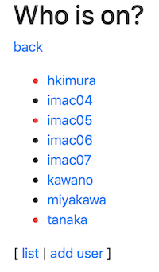
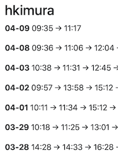

# Who is on?

プログラミングの勉強をもう一年したい学生のための春休みお手本プロジェクト。

課題は研究室出場記録を取る Racket プログラム。
具体的には、
WiFi機器（ケータイ電話を想定している）を持った誰がいつ LAN に接続したかを記録し、
ウェブで表示する。
who-is-on を実行する PC と ケータイなどの WiFi 機器が同一 LAN に接続していることを前提とする。

* who-is-on-update.rkt は、ARP テーブルに見つかる MAC アドレスをデータベースに記録する。

* who-is-on-app.rkt は指定したユーザの MAC アドレスが記録された日時を求めに応じて表示する。

* update.sh は who-is-on-update.rkt を呼んだ後、
update.sh 自身の呼び出しをat でスケジュールする。

### description

* 現在、研究室に来ているユーザ、電源が入っている PC を 
<span style='color:red;'>●</span>(赤丸)
で表示。

    

* 研究室メンバーの過去の出席状況一覧。

    

* 数時間ごとの各メンバーの記録。

    

### requirement

開発は macos, linuxmint 19.

* racket, sqlite3

```sh
$ sudo apt install racket sqlite3
```
* dmac/spin パッケージ

```sh
$ raco pkg install https://github.com/dmac/spin.git
```

### install

```sh
$ make create
$ cp env-template /some/where/.env
$ make install
$ racket ./who-is-on-update.rkt
$ racket ./who-is-on-app.sh
```

```
$ open http://localhost:8000/users
```

update.sh は who-is-on-update.rkt をほぼ１時間おきに実行する。
who-is-on.service はその systemd ファイル。

### FIXME/TODO

* なんだ、この uptime は？Racket のバージョンの違いか？

```
ubuntu@vm2019:/srv/who-is-on$ uptime
 13:10:01 up 6 days,  1:44,  2 users,  load average: 21.10, 15.35, 10.84
```

* who-is-on-update.rb に --verbose オプション

* when terminate who-is-on-app by ^C, visited end points will be echoed back.
  useless. danger. how to stop it?

* even if tmint pings to tmint itself, tmint's mac-addr does not
  appear on arp table.

```sh
$ ping 192.168.0.11
PING 192.168.0.11 (192.168.0.11) 56(84) bytes of data.
64 bytes from 192.168.0.11: icmp_seq=1 ttl=64 time=0.022 ms
64 bytes from 192.168.0.11: icmp_seq=2 ttl=64 time=0.036 ms
64 bytes from 192.168.0.11: icmp_seq=3 ttl=64 time=0.035 ms
^C

$ arp -an
? (192.168.0.14) at 00:11:32:9f:55:02 [ether] on enp0s5
? (192.168.0.32) at aa:b8:64:3e:d8:25 [ether] on enp0s5
? (192.168.0.1) at b0:ac:fa:cc:bf:d7 [ether] on enp0s5
? (192.168.0.2) at 68:5b:35:a0:53:74 [ether] on enp0s5
? (192.168.0.3) at c0:a5:3e:50:04:ee [ether] on enp0s5
$
```
* macos の at コマンド

    at: pluralization is wrong
    at: cannot open lockfile /usr/lib/cron/jobs/.lockfile: Operation not permitted

* nginx リバースプロキシーの設定方法

    名前ベースの仮想ホストは C104 での運用には適当ではない。
    パスベースでlocalhost:8000 へ振るんだが、

    * localhost の名前が使えないホストがある。
    * プロキシがつながらなくなる。sites-enable からのリンクでやった場合。

### FIXED/UPDATED

* 0.9 /list で一覧表示。

* 0.8 別 LAN の hkimura 状況をプッシュ。

* 0.7.2 nginx で basic auth
  working tree の中で sed しない。

* 0.7 /users/ のページに現在値を表示

* app installer、url の書き換え、DB を上書きyes・noオプション

    →  make install で。

* query-exec の回数を減らす。

    → 1時間に一度実行するくらいの頻度で呼ぶ関数。血眼にならないでよい。

* app installer、url の書き換え、DB を上書きyes・noオプション

* install の sed ができない。

  →  エスケープじゃなく、セパレータを換える作戦で。

* 2019-03-14 10 分おきに cron から起こすとして、確率 1/3 で実行するのは？

  → アラウンド 60 分後に実行するにしよう。0.5.4.

* 2019-03-14 macos の /usr/sbin/arp では 00 を 0 に短縮して表示する。
  string= で比較できない。mac= を定義するとしても、SQLite3 に組み込むのは面倒だ。

    → padzero を定義。0.5.3.3

### MAC アドレスの取得

ICMP ブロードキャストに反応しないホストもあるため、
サブネットの有効なアドレス 10.0.33.1..254 の一つ一つにタイムアウト付き ping を打つ。

ping を直列に実行しては
（タイムアウト時間） x （サブネットの数）
だけ時間がかかってしまう。

ping を並列に実行する関数を Racket でどう定義するかが問題。スレッド使え。

### 定期実行

プログラム自体でゆっくりループするか、cron で、
と思ったが、at コマンド で自分自身を 55〜65 分後に呼び出す方法に変更。0.5.4

cron, at は linux/unix の基本的機能の一つ。

### 取得した Mac アドレスの記録

SQLite3 にタイムスタンプと共に記録する。

* SQL できるようになれ。

* Racket でデータベースを扱う具体的な方法を身につけろ。

### 出場記録の表示

Racket の web フレームワーク dmac/spin で web アプリを作成する。

* get /users

  ユーザ一覧の表示とユーザ名から記録へのリンク。
  １時間前までに記録があれば bullet を赤で。0.7

* get /user/name

  ユーザ name の記録を表示。

* get /user/name/yyyy-mm-dd

  ユーザ name の yyyy-mm-dd の記録。 /user/name があれば不要か。

* get /users/new, post /users/create

  ユーザを追加する。

ユーザの削除は 0.6.2 まで定義していない。

### Web アプリのデプロイ

流行りは nginx のリバースプロキシだろう。


__M くん、勉強になったか？__


---
hiroshi.kimura.0331@gmail.com
